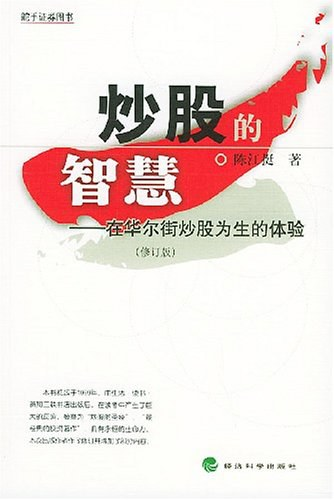

# 炒股的智慧

## 内容简介
作者以在华尔街十多年投资股市的经验教训为感性素材，在研读了西方几百年来的炒股名著和炒股大师传记的基础之上，对投资股市最根本、最重要的问题进行了深入的思考和探索，对取得成功的方法和过程进行了大繁至简、提纲挈领的阐述。其中包括华尔街的家训、学股的四个阶段、怎样克服负面的心理习惯并养成自己稳定的炒股模式、怎样选择临界点、怎样应对大户操纵、怎样利用大机会、怎样培养对股票运动的直觉……

## 作者简介
陈江挺，1962年生于福建，1982年毕业于上海交通大学，1983年赴美留学，分获机械工程和国际金融硕士学位。现以炒股为主。

## 目录
前言  
引子 三则故事  
第一章 炒股的挑战  
第一节 炒股与人性  
第二节 特殊的赌局  
第三节 一般股民何以失败  

第二章 股票分析的基本知识  
第一节 基础分析的基本知识  
第二节 技术分析的基本知识  
第三节 股票分析之我见  
第四节 什么是合理的价位 
 
第三章 成功的要素  
第一节 炒股成功的基本要诀  
第二节 资金管理  
第三节 成功投资者所具有的共性  
第四章 何时买股票 何时卖股票  
第一节 何时买股票  
第二节 何时卖股票  
第五章 华尔街的家训  
第一节 华尔街的家训  
第二节 大师论炒股  
第六章 从有招迈向无招  
第一节 炒股成功的心理障碍  
第二节 心理训练  
第七章 抓住大机会  
第一节 疯的故事  
第二节 疯故事解剖  
第八章 和炒手们谈谈天  
第一节 学股的四个阶段  
第二节 回答几个问题  
附录 金钱的反思  
