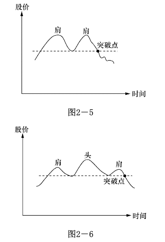

# 股票分析的基本知识
　　 基础分析主要分析公司的小环境，大环境的变化只是谈天的好材料，用来炒股的实用性不大。研究小环境中公司的经营情况是必要的。以我自己的经验，如果只靠走势图来炒股，不知公司到底是干什么的和干得怎么样，心里虚的很。（注：这与中国股市的情况是不一样的。中国的上市公司造假的太多，大多数散户没法了解背后的真实情况，而且是庄家市。所以还是以走势图来炒股更有把握些。不过基本的情况还是要了解一些。）

　　 你认为什么因素使投资者入市买股票？华尔街有过调查，使一般投资者入场买股票的原因最主要是股票在升而不是股票的成本收益比率低或红利高！同样，投资人卖股票的最主要原因是因为股票在跌！在跌！请记着：当街头巷尾的民众在谈论股市如何容易赚钱的时候，大市往往已经到顶或接近到顶。人人都已将资金投入股市，股市继续升高的推动力就枯竭了。而大众恐惧的时候，则该卖的都已经卖了，股票的跌势也就差不多到头了。我假设这本书的读者已具备最最基本的股票知识，如什么是股票、股票是怎样交易的等等。你如果这样的知识还不具备，我建议你先去找本股票常识读物。这类读物在任何书店都能找到，在书店占的位置通常都不会太冷僻。这些知识是死的，了解起来很容易。以我的观察，一个人若能稍微专心点的话，两个星期就足够了。在这里，我无意用一百页的篇幅来介绍到处都有的材料。每位认真的股市参与者，都应该有个自己的小图书馆，其中包括最少一本有关的股票常识读物。

　　 分析股票升跌及为何升跌的知识可以粗略地分成两大类：

　　 一，基本面分析（ Fundamental Analysis ）

　　 二，技术分析（ Technical Analysis ）

　　 技术分析研究股价、时间、交易量之间的相互关系，即图形分析，其它都属于基础分析的范畴。不要将两种分析完全分割开，它们其实是相关联的。我们在技术分析中看到的股价、交易量和时间的互动关系其实反映了投资者们对公司经营的看法。他们用自己的资金来为该公司的前景投票。（在中国市场是反映了投资者们对庄家操盘的看法。）

　　 和炒股息息相关的另一重要知识是怎样判定股票的大市，即股市的大趋势如何。要想炒股成功，判定大市的能力必不可少。牛市或熊市指的就是大市。大市升叫牛市，大市跌叫熊市。

## 第一节 基本面分析的基本知识
　　 基础分析家们相信：长期而言，股票的价格决定于公司的固定资产及其盈利能力。因此，任何影响固定资产及盈利能力的因素都在基础分析的考虑范围之内。这些因素非常之多，我在这里列出部分的因素并解释它们对股价的影响。我将它们分成大环境及小环境两类，大环境指公司外部的因素，小环境指公司内部的因素。另外，还将专门对最可能导致股票价格上涨的三个因素加以分析。

　　 基本面分析中的大环境

　　 1 、利率：可以这么想，社会的游资数目是一定的，当利率升高时，将钱存入银行的吸引力增加，这将使原先可能进入股市的资金流进银行。同时，利率的升高使公司的借贷成本增加；

　　 2 、税收：企业税增加，企业盈利中的税务支出增加，使得实际盈利减少，股价将往下调整。

　　 3 、汇率：当汇率上调，本国货币升值，增加出口困难，营业额降低，其结果对股价的影响主要是负面的。汇率属国际金融的范畴，它对股价影响的机制极其复杂，通常是国际政治经济角力的结果。到底汇率的变动怎样影响股价，谁也说不清，就这一课题有许许多多篇博士论文，更深入的研究就请读者们自己去做。我自己专修国际金融，深知它的复杂性，炒股的读者只要知道汇率也属影响股价的因素就够了。

　　 4 、银根松紧：银根松时，市场游资增多，对股票的影响是正面的。银根紧时正好相反。

　　 5 、经济周期：经济周期是市场经济的必然结果。当某种商品短缺，大家一窝蜂地投资于这种商品的生产，随后的结果便是生产过剩。当商品短缺时，价格高昂，生产厂家利润增加，反映在股市便是股价上升。一旦生产过剩，就只得减价销售，有时甚至亏本套现，这样盈利自然降低，股价的表现便是下跌。

　　 6 、通货膨胀：通货膨胀对股价的影响很难估量，通常政府为了控制通货膨胀，会调高利息，对股价的影响主要是负面的。

　　 7 、政治环境：大规模的政治动乱必然带来大规模的经济混乱。战争、政府的频繁更迭、政局的不稳定对股票的影响是负面的。

　　 8 、政府的产业政策：如果政府鼓励某些行业，给予扶持，如在税收上给予减免，融资上给予方便，企业各方面的要求都给予协助，结果自然对股价有正面影响。

　　 基本面分析中的小环境

　　 1 、营业收入：一个具有发展潜力的公司，其营业收入必须有快速发展的势头。去年卖出 1 亿元的产品，今年 2 亿，预计明年 4 亿。这样的公司常常提供了股价在短期内翻几倍的机会。

　　 2 、盈利：有些公司做很多生意，就是不赚钱。公司经营的好坏主要以盈利作为衡量的标准，盈利增加，股价自然上涨。

　　 3 、固定资产：固定资产就是公司现有所有的“不动”的资产。如果公司的市场总价是 10 亿元，固定资产是 15 亿元，你可以认为股价没有反映公司的价值，股价偏低了。

　　 4 、类似公司的情况：大家都生产类似产品，如电视机，其它公司的绩效和这家公司比怎么样？同类公司通常有类似的经济周期，股价的波动也类似。

　　 5 、品牌的价值：有人估算过，可口可乐这个名字便值 500 亿美元。你打算投资的这家公司有无过硬的品牌？这可能对股价有深远的影响。

　　 基本面分析主要分析公司的小环境，大环境的情况太过复杂，判断大环境主要用“股票的大市”。美国著名的基金管理专家彼得林奇曾发表看法：“我每年花在经济大势上的分析时间不超出十五分钟”。大环境的变化是谈天的好材料，用来炒股的实用性不大。大的政治动乱和经济震荡当然例外。研究小环境中公司的经营情况是必要的。以我自己的经验，如果只靠自己图来炒股票，不知公司到底是干什么的和干的怎么样，心里虚得很。研究公司的经营情况必须具备一点会计的常识，能看懂公司的财务报表。但这里面的游戏也很复杂。以销售收入而言，公司是怎样计算销售收入的？有些公司卖货后收到钱才算收入，有些发了货就算收入，更有些把订单都算在内。发了货能否收到钱是个问题，订单也有可能被取消。固定资产怎样算也有学问。有些老工厂在纸面上还值不少钱，而实际上那些旧机器送人都没人要，你说固定资产是多少？按通常的买价减去折旧来算固定资产，得到的数字可能很漂亮，其实没多大意义。读者们在研读财务报告时，必须留意这些细节。

　　 导致股价上涨的三因素

　　 虽然引起股价增长的因素很多，但最重要的是盈利及盈利增长。这个理由是明显的，不赚钱的公司要来做什么？下面让我们看看三个最重要的影响股价的因素：

　　 1 、盈利的增长

　　 成本收益比率是很重要的概念，即股价 / 收益所得到的数额。但我发觉新手们常常过于注重成本收益比率，他们把它当成股价是否偏宜的衡量标准。这种概念从根本上来说是对的，但在炒股上实用性不大。美国的微软公司上市初期，成本收益比率超过 100 ，就是今天，它也超过 50 。十三年前你买了 1 万美元微软的股票，今天就是百万富翁。一个健康、发展迅速的公司，其盈利必定逐年增长。这个增长的速度越快越好。一个公司的盈利若能以每个 25% 的速度增长，那么三年就能将盈利翻一倍。盈利增长的速度必须建立在合理的数字上。去年每股赚了 1 分钱，今年 2 分钱，盈利增长了 100% ，但这个数字是没有意义的。如果公司的盈利从每股 5 角升到 1 元，这个 100% 的盈利增长定将使投资大众的眼睛发亮。盈利增长的前提是销售收入的增长。一个公司的销售收入如果无法增长，盈利增长通常是玩会计游戏的结果，对这一点读者们要留意。另一必须留意的是销售收入增长的速度和盈利增长速度的关系。公司的营业额由 1 亿元升到 2 亿元， 100% 的增长率。但盈利只从 5 角升到 6 角， 20% 的增长。这时要好好调查一下为什么？是不是同类产品多了竞争者，公司只好削价求售？虽然营业额不错，但收益率却降低了！如果是这样的话，这只股票的升幅也就有限了。最使市场注目的盈利的加速增长。一个每年盈利增长 25% 的公司突然将增长速度提高到 40% ，甚至 50% ，这通常铺好了股价成倍上翻的道路。

　　 2 、新产品

　　 如果有家公司发明了根治癌症的新药，你可以想像这家公司的前景。新产品提供了公司快速增长盈利的可能。这类例子很多，如：

　　 美国的新态公司在 1963 年发明了口服避孕药，结果其股价在六个月内翻了五倍。王安电脑因为其新型的文字处理机，在 1978 年至 1980 年间，公司股价升了十三倍。快餐店的概念成形初期，麦当劳公司的股价在 1967 年至 1971 年的四年间翻了十一倍。新产品并不局限于“实物”，可以是新的生意概念，新的推销手法，新的管理方式。

　　 3、公司回购自身股票

如果公司购回自身股票，这是好消息。公司购回自身股票是对本公司投信任票。通常来讲，公司只有在认为股票的股价水平不反映公司价值时才会这么做。同时，回购股票使流通的股票量减少，在相同的盈利总数下，每股的盈利数字就增加了。这就起到降低成本收益比率的作用。另外值得留意的是公司股票总流通量的数目，数目越大，股票上升的步伐就越难迈开，因为需要大的买压才能推动价格上升。

## 第二节 股票技术分析的基本知识

　　 简单地说，技术分析就是看图。技术分析探讨股票价格、交易量和时间的相互关系，以此判定股票下一步运动的可能方向。技术分析的目的是确定股票的走势以及走势的转变。炒手们根据技术分析提供的信号，买进卖出以赚取差价。
　　 由于人性相近，在相同的外部条件下，人们通常有相近的反应。这一切都会在图中表现出来。炒手们可以通过研究过去股价运动的规律来推测未来的走向。技术分析的心理基础是建立在人性相近这一假设之上的。这个假设成立，但并不完美。人是极其复杂的，股价变动虽然反映了投资大众集体思想和行动的结果，但它不可能完全地重复。所以说炒股是门艺术，不是科学。但只要这种集体行动的结果有类似的特点，抓住这个特点，炒手们就有可能拥有在股市上超过 50% 的获胜概率。

　　 技术分析中常用图形介绍

　　 技术分析在华尔街已发展成一个体系，有关技术分析的书常有五六百页之厚。就我个人这么多年的炒股经验，觉得这些书的内容多在钻牛角尖，为了分析而分析。我在这里将我在实际操作中证明最为有用的概念写出来给大家分享。这些图和分析都很简单，但我每天都在用，它是我用来判断股票运动是否正常的指标。

### 1 、股票的走势及走势线

　　 图2-1是典型的升势图，将波浪的低点相连，即成升势线。在升势图中，请注意交易量的变化。在上升阶段，交易量增加，下调阶段，交易量减少。每个波动的最高点较上个波动为高，最低点也较上一最低点为高。

　　 图2-2是典型的跌势图。将波浪的高点相连，便成跌势线（阻力线）。在跌势时，交易量没有特别之处，但跌波的每个波峰较上一波峰为低，波谷也较上一波谷为低。

　　 图2-3是无势图，你根本就不知道这只股票的大方向是什么。交易量也没有特色。一只无势的股票通常不适合炒作。

　　 心理分析： 有人问一位投资专家：“股价为什么会升？”他想了会儿说：“因为买者多过卖者。”现在大家明白了，股票升的原因不是低的成本收益比率，也不是高的红利或是其它堂皇的理由，而只是因为买者多过卖者。虽然成本收益比率或红利都会影响投资者买卖的决定，但它只代表了过去。影响投资者决定的最重要因素是对未来的预期。一只成本收益比率很高的股票，表示这家公司过去没赚什么钱，但不表示它未来也不赚钱。

　　 以升势为例，升势开始时一定是买主多过卖主，因为在无势时，买卖的力量基本均衡。 一下子多出了许多买主 ，在交易量上的表现就是交易增多。随着股价的升高，第一波买主入了场，这时有人在账面上开始有收益，他们开始获利卖股，我们在图上就看到反调。这时的卖主总的来说不多，我们会看到交易量减少。否则这便是不正常的升势。如果股票确有吸引力，如开发成功什么新产品，第二波买主会进场，重复第一波的过程。在图形上，我们看到一浪高过一浪，股票总是以波浪形上升。

　　 股票的运动有点像推石球上山，要往上推，你要很大的力，但石球往下滚，用不着很多力气。在股票跌势时，买主消失，不大的卖压就会使股价往下跌。虽然其间有人拾偏宜货，这种下跌时的反弹是靠不住的。在图形上是一波低过一波，但交易量并不具备什么特色。

　　 无势图表示市场对这只股票没有什么看法，它在某一区间漫无目标地游动。买方和卖方的力量基本平衡。朋友，你认为什么因素使投资者入市买股票？ 华尔街有过调查，使一般投资者入场买股票的原因最主要的就是因为股票在升！你明白了吗？一般投资者入场买股票主要不是因为股票的成本收益比率低或红利高，而是因为股票在升！升！升！ 除了股票在升的理由之外，其它因素都是次要的。这就是为什么股票一开始升势，它往上一波高过一波，不会马上停止。要想学习养成对股票运动的感觉，你必须牢牢记住这一点。

　　 你能猜到为何一般投资人卖股票吗？读完上一段落，结论应该很明显。华尔街的调查证实了你的猜测：投资人卖股票的最主要原因是因为股票在跌！在跌！投资人卖股票不是因为成本收益比率高或其它原因，而是因为股票在跌。这就是为何跌势一开始，不会马上停止。

　　 现在你能体会到为什么股票升时常常升得离谱，跌时跌到惨不忍睹的原因了吧？记住股民买卖股票的真正原因，耐心地观察市场，你很快就会发现股票运动是有迹可循的。

### 2 、支撑线和阻力线

　　 图2-4标注了支撑线和阻力线，当股票在一定的区间波动，把最高点相连便成阻力线，把最低点相连便成支撑线。

　　 从字面上解释便是股价升到阻力线时会碰到很大的阻力，不容易继续升上去，即出现很多卖主。而股价跌到支撑线时会发现很多买主，股价不容易跌下去。

　　 心理分析： 走进交易大厅，你有没有常常听到“这只股票跌到 10 元钱我就收进”，“这只股票升到 15 元我就卖出”之类的话？答案是肯定的，因为这也是我常听到的。为什么一般的股民会认为某只股票跌到 10 元就值得吃进，而升到 15 元就该脱手呢？这也源自我们日常生活的经验。精明的主妇通常知道某种衣服的最低价是什么。如果衣服以这个价格出售，大家便纷纷抢购。而衣服牌价升到某个价位，就没有人问津了。这可以分别称为衣服的阻力价和支撑价。

　　 在股市上，如果参与交易的多数投资者认为 10 元是某股票的最低价，一旦股价跌到这个价位，便会有很多人买入，股价自然就跌不下去。在图上我们就看到支撑线。阻力线的道理相同。如果一个款式的衣服在 10-15 元之间的价格波动，想像一下服装商是怎么做生意的。

　　 当衣服的价格在 10 元的时候，买主认为衣服的价钱便宜，入场购货。但卖主会觉得价钱偏低，更低就不卖了。在 15 元时，买主觉得价钱高，不愿买，虽然卖主想卖更高的价钱，没有买主他无计可施。所以在 10 元时，因买主多过卖主，价格开始上升，但在 15 元时，卖主多过买主，价格只有下降。

　　 或迟或早，有人会对这个价格区间持有不同看法，认为衣服的价钱太高或太低。无论这是一位大户还是一批小服装商，他们的行动将使买卖的力量失去均衡。如果他们的力量够大的话，将引起一连串的反应。无论是正在买卖的服装商还是在外观望的投机商，他们的行动将会改变 10-15 元的交易区间。如果新的均势有利于买主，这将吸引新的买主入场，带来新的买压，而卖主期待更高的价钱，他们的惜售将会使卖压进一步减轻。结果是使衣服的价钱高出 15 元。随着价钱的进一步升高，卖出的诱惑力越来越大，衣服的价钱会在新的均衡区间摇摆。这个过程便是阻力价或支撑价的突破。在股票上，我们便有阻力线和支撑线的突破。

　　 需要指出的是，阻力线一旦被突破便成了新的支撑线，同样，支撑线一旦被跌破便成了新的阻力线。让我们以支撑线为例：在支撑线附近，足够的买方出现，卖方消失，股价无法跌破该线。几个来回之后，市场形成这便是“最低价”的概念。突然间，更大的卖压出现，股价跌破支撑线，这时认为支撑线就代表“最低价”的买主全部亏钱。其中一部分可能止损抛售， 另 一部分固执原来的想法，认为股价很快就会反弹。无论如何，原来市场对该股的“底价”概念已被粉碎，市场“背叛”了他们。

　　 现假设股价又升回原来的支撑线，你认为原先的投资人有什么反应？那些还未“止损”的人会感谢上帝给他们一个全身而退的机会，股价跌破支撑线的那段亏钱的时光令他们寝食难安，现在终于有个不亏甚至小赚的机会，他们会赶快卖掉股票以结束噩梦。

　　 再看看那些止损出场者，他们原以“底价”入场，结果被烫伤。今天股价又回到这个价位，但烫伤的记忆犹新，他们大多不敢在这个价位重新入场。我们看到卖压增加，买方的力量却有所减少。所以支撑线一旦跌破便成了新的阻力线。阻力线一旦被突破便成支撑线的道理相近，读者们可以自己考虑一个其中的原由机理。

### 3 、双肩图和头肩图

　　 图2-5是典型的双肩图， 图2-6是典型的头肩图。这都是炒股中常见的图形。

　　 心理分析： 以双肩图为例。它的典型特点就是两个高点。要提醒读者，这两个高点的选择是和时间的跨度相关的，很明显，一天的高点和一年的高点是完全不一样的。但它们的解释相同。

　　 随着价钱的升高，买主们开始怀疑价钱是否能超过原来的最高点？卖主也在观察这个最高点是否还像上次一样会带来卖压，使价格的升势挫折。简单地说，市场参与者在观察这次会不会有和上次同样的经历。上次价格升到这点引发买卖力的逆转，这次会发生同样的事情吗？

　　 结果只有两个：穿越上次的最高点和不能穿越上次的最高点。在双肩图中，因为无法穿越上次的最高点，市场对价格的看法产生变化，股民对在这点附近持股感到不自在。在股市中，你会看到股价逐步滑落。但假如买力不减，继续穿过上次的最高点，我们就回到升势图去了。

　　 头肩图的道理和双肩图类似。读者们请自己想像一下在其过程中股民的心态变动过程是怎么样的。头肩图可以当成双肩图的变形。这些图还可以倒过来看（见图2-7, 图2-8）。

　　 如果说正双肩图给你提供了卖的信息，那么倒双肩图便给你提供了买的信息。在这些图的后面其实是股民们对该股票价格认定的心理变化。你要用心来感受：如果你是股市的一员，你会怎么想，你会怎样做？这样，你慢慢地就会形成何时入市、何时出场的直觉。

### 4 、平均线

　　 平均线的目的主要是用来判定股票的走势。

　　 股价的运动常常具有跳动的形式，平均线把跳动减缓成较为平坦的曲线。

　　 计算平均线的方法有许多种，最常用的是取收市价作为计算平均值的参考。比如你要计算十天的平均值，把过去十天的收市价格加起来除以十，便得到这十天的平均值。每过一天，分子式加上新一天的股票收市价，再减去倒第十一天的收市价，分母不变，便得到最新的平均值，把平均值连起来便成为平均线（见图2-9）。

　　 平均线的形状取决于所选择的天数。天数越多，平均线的转折越平缓。

　　 我自己习惯用两百天平均线来衡量股票的长期走势，五十天平均线来衡量中期走势。我不怎么看五十天以下的平均线，因为我发现其参考价值不高。股票短期的运动方向我注重股价及交易量。

　　 我通常不买股价在两百天平均线下的股票，做短线时例外。

### 5 、其它图形

　　 我自己日常留意的技术分析图形就是上述四种。但这节的题目是技术分析的基本知识，我不得不提一下其它图形，否则名不符实。

　　 一般的技术分析书都会提到三角、隧道、旗子等等的图形。遗憾的是，我的实践经验证明它们没有什么实用价值。便对我没有实用价值并不表示对其他人也同样没用，我建议严肃的炒手自己去找这方面的书学习。我将本书的范围限制在自己亲身证明最有用的知识，并不打算包罗万象，请读者原谅。

　　 有电脑软件的朋友常常会看到 MACD 、威廉 % 等等电脑计算的买卖指标，流行的有二三十种之多。我学股的第二年曾花很多时间研究这些指标，结果上了大当。我自己花了很多学费后才明白这些指标都有“见光死”的特点。也不能说这些指标错了，这些指标的发明者通常有辉煌的经历。想像一下：如果每人都按照这些指标提供的买卖信号炒股，结果将会是什么？我自认站在巨人的肩膀之上，结果从巨人肩膀跌下来，摔惨了！我自己常用的前面三个图形也不是我自己发明的。但我在实践中体会到它们背后的心理因素，人性是不容易改变的，所以它们一直有效。希望它们不会因为这本书而同样“见光死”。当然，我相信不可能，人性哪有那么容易改变的？关于其它图形背后的大众心理变化的合理解释，有待行家高手的进一步研究。

### 6 、综合看图

　　 图2-10：综合走势线及阻力线和支撑线，在支撑线稍下的点是卖出点。支撑线一旦被跌破，表示升势结束。

　　 图2-11：和图2-10类似，但有别于阻力线，我们这里看到头肩图。道理和图2-10相似。

　　 图2-12：把图2-10倒过来，我们就有了最常见的买入理想点。记住如果这是升势开始的话，交易量通常增大。

　　 图2-13：这是我们在炒股中常见的股票运动图。我标出了各个不同的买入及卖出好点。请读者用心体会一下为什么。具体怎样操作，我将在“何时买股票”一节详细解释。这些买卖点还可以改进。

　　 现实社会往往和理想社会有差异。股市也一样!我们以上讲了这么 多图像和其后的心理脉络，一切都很明白，那是传统的股票技术分析。 随着时代的进步，有报道说今天在美国股市的交易量有70%是电脑交 易，电脑可没有什么感情!那么这些图像后面的心理过程还成立吗?答 案可不容易做。毫无疑问的是，不管是人交易还是电脑交易，交易必须 用钱完成;股票升了，一定是买盘胜过卖盘!无论是个人下单买还是指 示电脑下单买，一定有资金在入场。

### 股票的正常运动和周期运动
#### 1 、股票的正常运动

　　 把握股票走势最最关键的是判断股票是否处于正常运动状态。我认为下列几点有助于读者朋友从概念和操作上体会和掌握什么是股票的正常运动。

　　 股票的走势及走势线：在正常的升势中，每个波浪的最高点应较上个波浪的最高点为高，最低点也应较上个最低点为高。整个股价的运动应该在走势线之上。在正常的跌势中，波浪应一浪低过一浪，最高点较上个最高点为低，最低点也较上个最低点为低。

　　 支撑线和阻力线：一旦阻力线被突破，股票应该继续上升，虽然可能有反调，便反调不应该跌到阻力线之下，否则便是不正常运动。同样，一旦支撑线被跌破，股票应往下跌，否则的话，便是不正常运动。如果股票一跌破支撑线便反弹到支撑线之上，可能是买股的好时机。

　　双肩图和头肩图：和上述道理相同，一旦股价穿越突破点，它应能够继续，否则的话便可认为是不正常运动。

　　平均线：以两百天平均线为例，一个正常的升势，股价应在两百天平均线之上；一个正常的跌势，股价应在平均线之下波动。否则，都可以认为是不正常运动。

#### 2 、股票的周期性运动

　　在华尔街两百年的历史中，发展出很多理论来描述股票的波动现象。如道氏理论、伊列波形理论等等。这些理论有假设，有论证，读起来又长又乏味，但它们历久不衰，自有其参考价值。就我个人的体会，这些理论很难在实践中应用。除非你是只看大势、手握巨资的基金管理人。

　　随着自己对股市认识的增加，终于明白这些玄乎的理论无非在讲经济周期。任何学过点经济学的人都明白经济周期是什么玩意。以下我简单地解释经济周期怎样在股价上反映出来。这些知识能加深你对股市的认识（如图2-14）。

　　可以将股票运动大约分成四个时期，分别为蓄劲期、爬坡期、疲劳期和下坡期。

　　蓄劲期：买卖双方的力量基本平衡。

　　爬坡期：买压胜过卖压。

　　疲劳期：买压和卖压又本持平。

　　下坡期：卖压强过买压。

　　在任何时期，股票的波动都是波浪形的。每个大波动内包含有很多反向的小波动。平均线将中和这些小波动且指明大趋势。必须强调，股市操纵可能改变每天的或短期的波动，但不可能改变大势。道氏理论特别指出这一点。

　　股票运动的四个时期其实吻合了经济周期的规律。在上个经济周期的末期，因为生产过剩，产品价格跌落，存货增加，公司的盈利减少，股价下跌。

　　蓄劲期便是恢复期，在这段时间，公司将不畅销的产品淘汰，减少存货，为经济复苏准备。

　　经济复苏期在股价上的表现便是爬坡期。随着盈利的增加，公众又开始争购公司的股票，股价节节高。

　　经济复苏持续到一定阶段， 就到了疲劳期。疲劳期接着就到下坡期 。下坡期到了一定地步又进入蓄劲期。整个过程就是经济周期在股价上的反映。

　　马克思的政治经济学主要目的便是解决不断重复的资本广义经济周期对社会负面的影响。但实践的结果并不理想，计划经济有其本身的缺陷。中国今日引进市场经济，大家近来看到的肉、蛋、柑桔等生产过剩、价格下跌的现象便是经济周期其中的一环。

　　在蓄劲后期，爬坡初期，如果是开始一个真正的爬坡期，应有交易量增加的现象，股价一举突破阻力线。一旦进入爬坡期，股票开始升势，股票波动应具有“一波高过一波”的现象。虽然这并不绝对，但整个波动应该在两百天平均线之上。在这段时间，投资者们必须安坐如山，不要为股价的短线升跌吓出场，但要打起十二分精神注意危险信号。

　　经过疲劳期，股价跌穿平均线及支撑线，便是离场的时候了。

　　有些小公司具有特点的产品，它不受一般经济周期的影响，但其股价波动也具有相似的特点。一旦市场接受其产品，销售及盈利的潜力会反映在投资者的行动上。他们开始标高股价，我们将看到交易量上升。这些投资者很多并不是短线炒作者，他们买好股票就放在一边，使得公司在市面自由交易的股数减少。此时股票用不着很大的交易量主能攀升。这类小公司的股票在上升时其速度常常很快，短时间内可能会升数倍。自由市场的机制是自由竞争，很快你就会在市场发现类似或可替代的产品。在今天的市场环境，一个热门产品永葆热门几乎是不可能的。竞争的结果就是销售及盈利增长的减缓，又重复从畅销到滞销的循环。（附注：所以不断创新是制胜的关键）

　　这些小公司的股票同样经历四个阶段，只是这四个阶段的起伏较大公司来得剧烈。

## 第三节 股票分析之我见
　　对一般股民而言，唯一关心的是股价什么时候会升，什么时候会跌。而我们知道股票会升的唯一原因是买者多过卖者，股票会跌的唯一原因是卖者多过买者。股票分析能够定量出股价什么时候升跌吗?答案是不完全能!

　　想象一下什么因素会让股民买股?政治的、经济的、心理的、环境 的等都是可能的因素，这些都无法定量。金融分析者发明出“本益 比”之类的指标，试图将股价的评估量化，但本益比同样不能指明股价明天会升还是会跌。那么这些分析理论的目的何在?答案是这些分析提高了预测股价运动方向的准确度。也就是说可以提高股民入市的胜算率。

 ### 我怎样看技术分析
　　 由于我自己以中短期炒作为主，技术分析是我买进卖出的主要参考。简单地说，我主要靠这几个图吃饭。但对没有多少经验的炒手来讲，你想也靠这几个图吃饭可能没有这么容易。

　　 记得我在大学读书的时候，曾看到数学家华罗庚谈读书有从薄到厚，又由厚到薄的过程。即开始时你什么也不懂，书自然很薄，随着学习，你发现该学的越来越多，书就变得很厚。最后你读通了，明白要点就是这么多，书就又变得很薄。这个过程可以推广到学习任何技能，炒股也不例外。

　　 今天的电脑科技已发展到国际象棋击败世界冠军的地步。因为国际象棋的变化有限，一旦把几乎所有的变化输入电脑，它的计算速度是人所不能及的。在机器面前，人就只有投降了。1996 年，美国 IBM 的电脑深蓝击败俄国的国际象棋世界冠军卡斯帕诺夫曾经成为全球的头条新闻。以电脑的计算能力，区区几个股票走势图根本算不了什么，但电脑迄今还只能是炒股的辅助工具！想想其中的原由，你就会明白炒股没有这么简单。

　　 《华尔街日报》登过一则这样的故事：一位记者靠抛硬币在十字坐标上画线，硬币出正面就升一格，反面就降一格，抛了几十次硬币后就画出一条曲线。他把这条曲线交给一位著名的技术分析专家研究，说是一只股票的走势图，请教他的意见。该技术分析家看图后说该股票极具上升潜力，一定要知道这只股票的名称。记者如实相告，该技术分析家听后勃然大怒，拂袖而去。这位记者便据此写了一篇报道。你读了这则故事有什么感觉？就我看，这位技术分析家犯了个严重的错误，他没有问交易量到哪儿去了？

　　 这章讲的几个图，看来极其简单，但我敢讲这是由“薄”到“厚”，又由“厚”到“薄”过程的后面一个“薄”。你想跳过中间的“厚”而由“薄”直接到“薄”是办不到的。一位过来人告诉你后面的“薄”是什么或许能缩短你“厚”的过程，但你一定必须经过“厚”的阶段。不要把技术分析孤立起来看。研究股票的大市，研究公司的经营情况，研究公司的产品，再看股票的走势图，特别还要注重交易量的变化，只有在这个基础上，技术分析才有意义。最最重要的是记住止损。

　　 这些图是死的，在实际操作中，你会碰到很多例外，只有通过实践你才知道怎么处理这些例外。这些图之所以重要，因为它提供了最好的临界点，在第四章，我会详细介绍。

### 我怎样看股票的大市

　　 炒股高手利弗莫尔是这样强调股票大市的重要性的：

　　“炒股的诀窍便是在牛市中全力投入，在牛市结束或接近结束的时候卖掉你的所有股票。”

　　 股市就似羊群，单独股票就象羊群中的羊。当羊群朝某个方向前进的时候，大多数的羊跟随着同一方向。股票也一样，在牛市的时候，大多数的股票升，熊市的时候，大多数的股票跌。

　　 就如做其它生意，顺势是成功的基本保证。做服装生意的要卖流行款式，不要进冷门的式样。炒股票的道理也一样。不管你选了多好的股票，在大市向下的时候，它跌的机会大过升的机会。那么怎样确定股票的大市呢？

　　 要确定大市的走向，最重要的是每天要追踪股票指数的运动。如美国的道琼斯指数，日本的日经指数，香港的恒生指数，上海、深圳的综合指数等等。

　　 就我自己的经验，用技术分析的方法来判定大市的走向及走向的变动是最为有效的工具。研究股票指数图，把它看成一只股票，看看这只股票是处于什么运动阶段，它运动正常吗？

　　 留意每天的交易总量。如果股市交易总量很大，但指数不升，或开市走高，收市低收盘，这就给你危险信号了。留意一下周围发生了什么事？中央银行是否要调整利率？周边国家是否有动乱？大市的转变通常有一过程，它较单独股票转向来得慢。大市的转变可能需几天，也可能是几星期，重要的是感到危险的时候，你必须采取动作。

　　 同样，你要留意股市跌到底时所提供的信号。当股市跌了很多，跌到大家都失去信心的时候，你会发现有一天股市狂升，可能升 1% 或 2% ，交易量很大，这往往是跌到底的信号，大户开始入场了。但这还不是进场的最佳时机，被下跌套牢的股民可能乘这个反弹卖股离场。如果在此之后，股票指数突破上一个波浪的最高点，你可以证实跌势基本结束，是进场的时刻了。从图上看这时应有升势时具备的特点。

　　 股市的运动不断重复，你要仔细研究过去的规律。拿份长期的综合指数走势图，研究过去发生的一切，随着时间的推移，你就能培养起对股票大市的感觉。

　　 判断大市走向是极其重要的。我发觉新手（我自己以前也是一样）用很多心思研究单独股票的基础层面和技术层面，认为再好的市场也有股票跌，再坏的市场也有股票升，所以忽视大市的走向。我要在这里强调：炒股是概率的游戏，逆大潮流而动，你的获胜概率就被大打折扣了。

　　 将大市和单独股票结合起来考虑，是专业炒手们必须培养的心态。虽然这有一个学习过程，但一定要在心理上不断提醒自己：大市不好时，别买任何股票。

　　 请记着：当街头巷尾的民众都在谈论股市如何容易赚钱的时候，大市往往已经到顶或接近到顶。人人都已将资金投入股市，股市继续升高的推动力就枯竭了。而大众恐惧的时候，则该卖的都已经卖了，股票的跌势也就差不多到头了。

　　 判断股市大市还应注意下列几点：

　　 1、大的政治环境和经济环境有什么变动？今天的企业越来越具全球性，其它国家发生的政治经济危机将会影响本国的市场。近来东南亚发生的经济危机便是最好的例子。

　　 2 、本国的经济大势怎么样？通货膨胀的情形如何？外汇兑换率有无变动的可能？中央银行会调整利率吗？

　　 3 、所谓的股市龙头有什么表现？在股市到顶之前，你会发现股市的龙头股在大市到顶之前的一段时间开始疲软。

　　 4 、垃圾股有什么表现？在股市到顶的前一段时间，一些平时没有人闻问的小股票开始变得活跃且向上升。龙头股的价格已贵到买不下手的地步，社会游资便开始涌向三四线股票。

　　 5 、每天收市的时候，有多少只升的股票？有多少只跌的股票？综合指数有时会被几只大股票糊弄。一只在综合指数占有大份额的股票偶尔会影响真正的方向。比如某天有 1/4 的股票跌， 3/4 的股票升，但 1/4 的跌股中可能一只在综合指数占大份额的股票，如香港的汇丰银行，使得综合指数下跌。在这种情况下，综合指数不完全反映大市的真实走向。

　　 6 、考虑类别股。如金融股、电子股、房地产股等等。虽然大市的综合指数走升势，其中某些类别可能在走跌势。研究大市走向时，应将类别综合考虑。  
　　 特别是有时大市的走势并不明显，但金融股可能处在升势，电子股却走跌势。炒手们应根据类别股的运动形态来决定具体某只股票的买卖。

## 第四节 什么是合理的价位

　　 我们知道：在某个价位，有人愿买，有人愿卖，一旦成交，股价就确定了。有些人认为股价合理，也有人认为荒谬。但合理和荒谬的根据是什么？有这样的根据存在吗？股票的价格和价值到底有什么样的联系？

　　 这是个很难回答的问题，这个问题的答案也随时间的变化而变化。

　　 首先让我们看看现代金融理论中最流行的“现金值法”是怎么判断合理股价的。

　　 什么是现金值？如假设通货膨胀10%，则今年的1元是1元，明年的1元便仅能买今天的0.9元的东西，所以明年1元的现金值是0.9元；同理，后年的1元现金值便仅能买今天的0.81元（0.9×0.9）的东西，它的现金值便是0.81元。以此类推，10年后1元现金值要10个0.9相乘，约等于0.387，即10年后的1元只能买到今天值不到4毛钱的东西。

　　 假设某股票每年可赚1元，年年如此，且通货膨胀也是每年10%不变，则这只股票每年赚钱的的现金值总和便是已简单的等比级数的总和：  

　　 1+0.9+0.81+0.729+···=10

　　 这个10元就是该股票的现金值。

　　 当今华尔街通常将股票的现金值当初股票的合理价值。即这只股票值10元，若股价在10元以下交易，分析师会说股价低估了，否则便是高估了。

　　 大家有没有留意：要得到股票的现金值需两个假设，一个是通货膨胀，另一个是未来盈利。大家若有机会看到那些华尔街证券分析师的分析报告，通常都会看到这两个假设，且按这两个假设得到的现金值来判断股票的合理价位。由于假设人人会做，巧妙各有不同，所以不同的分析师对同一股票常产生完全不同的结论，有人说股价高了，有人说低了，各有理由。

　　 请大家注意：由于没有人知道未来，所以任何用现金值法得到的结论都是“猜”的结果。或许用“猜”难听些，用“合理的推测”会让这些分析师感觉好一点。但也就是因为这个缺陷，因为没有人知道未来！所以分析师对股价的评估都只能作参考。天晓得他的假设是对还是不对！你怎么知道后年的通货膨胀是什么数字？

　　 我们在第一章讲了个母猪变凤凰的故事，给大家的印象似乎股价和股值完全没有关系例子成立。但在实际中会有变化，在实际中人总是试图合理评价股价，且以之作为行动的参考，太离谱的不会长久存在。德国有位炒家位股价和股值做过一个极好的比喻：想象你外出遛狗，狗有时跑在前面，有时跑在后面，你拴狗的绳子有时长，有时短，但无论如何，狗最终会跑回你身边。你就是价值，狗就是价格。体会一下这个例子，你会明白东西，太离谱的股价会发生，但通常不会维持很久。

　　 有人愿买，有人愿卖，股价就确定了，这很容易明白和接受。跟多人会问：价值是什么？它又是怎么定的？凭什么定？标准是什么？1斤猪肉5元钱，1栋房子50万元，他们有使用价值，所以金钱价值也容易接受。那么股票呢？股票没有使用价值，它代表了企业的股份，即这些股份的价值判断也随时间的变化而变化，企业所代表的财富在不同的时间有不同的内容。

　　 我看过一篇文章，讲欧洲远古人的食物主要是肉食（我没有亚洲人的资料），通过对他们粪便的分析，他们食物中肉的成分超过70%，随着时间的推移，他们膳食中谷物的含量不断增加，肉食不断减少。直到现代才相对稳定，文章将人类发展分成狩猎社会、农业社会、工业社会和信息社会，让我们看看这些不同的社会的价值观念是怎么变化的。

　　 在狩猎社会，土地是没有价值的，它没法提供温饱，无助于生命的延续。财富的表征是人的狩猎能力。你的力量，奔跑的速度，张弓的准确度等等，这个时代对现代人观念的最大影响大约就是女孩还是喜欢自己的配偶个高力大。

　　 进入农业社会，对价值和财富的判定产生了很大的变化，财富的概念从狩猎的能力转移到拥有土地的数额和耕地的技巧。你的勇敢，奔跑的速度不再那么重要，重要的是你所拥有的土地及这些土地能给你怎么样的收成。你自己不能耕种的话，你可以请人帮助。无论这些土地是用来种稻还是放牧，你的财富和拥有土地的数量有关。

　　 请注意：从狩猎社会到农业社会，人们衡量财富和价值的标尺已完全不同，它已从人的高大健壮转移到土地拥有。

　　 进入工业社会，这个价值的评判又有了新的标尺。它从土地拥有转移到制造能力和运输能力。特别是自19世纪出现内燃机和电动马达，它使得大规模的机械化的生产成为可能，在很小土地上，人们建造工厂，生产出惊人数量的产品，这些产品经蒸汽机推动的轮船运往到世界各地，创造出惊人的数额和财富。这个过程不受季节的影响，也和天气无关。

　　 机械化生产使得价值的判断变复杂了，习惯了农业社会思维方式的生意人（或金融分析师）可能有这样的语言：“你看看，那件公司的股票价钱完全疯了！它拥有一间小小的响个不停的工厂，只有那么一点点地，不生产麦子，也不可能生产麦子，现行公司的合理价钱是它所拥有土地可能生产小麦的5倍，而那间叫什么工厂的公司价格居然卖到它所拥有土地可能生产小麦的5000倍，人们完全疯了，这样的公司的股票居然有人买！”

　　 生活在200年后的我们或许会将上面一段话当成笑话。当看看我们的周围，请问谁知道怎么合理的评估互联网公司？互联网公司的评估标准是什么？什么样的股价是合理的股价？大多是互联网公司既不拥有土地，也没有工厂，只有几位目光呆滞的年轻人在办公室敲着键盘，这些公司很多不赚钱，在可预见的将来也看不到赚钱的希望。

　　 我们生活在从工业社会转型到信息社会的关口。互联网公司属于信息社会的产业，现今流行的企业评估标尺如本利比、现金值、固定资产值等等是用来评估工业社会企业的，它取代了农业社会丈量土地的方法，但用它来评估信息社会的企业可能并不十分合适。近来网络股的大起大落在一定程度上便是社会不知怎么合理评估这些新型企业的价值在金融市场的反映。

　　 信息社会的企业应怎么评估还有待新理论的出现。也许读者中会有一位成为新理论的开创人。但在新的能为大众接受的新评估标尺出现之前，可以预见这些企业的股价还会大起大落，我们应该庆幸这些新困惑的出现，它说明人类文明又前进了一大步。