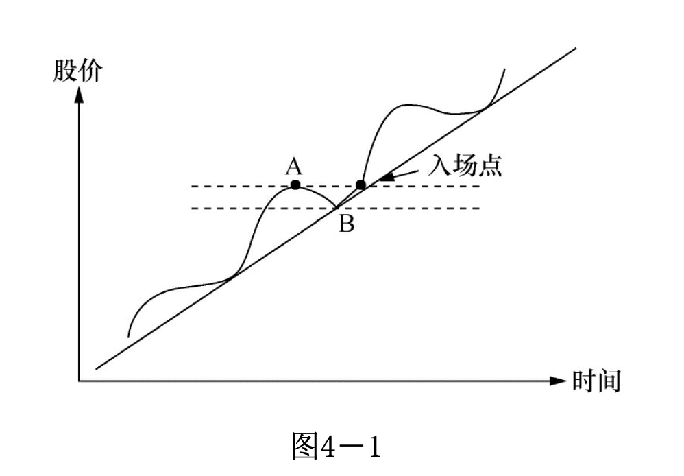

# 第四章 何时买股票何时卖股票

　　学习寻找临界点的过程其实就是学股的过程，当然其中还包括学习炒股的正确心态。坦率地讲，学找临界点的技巧还比较容易，培养心态才真正困难。

　　华尔街将炒股的诀巧归纳成两句话：截短亏损，让利润奔跑！英文叫 Cut loss short, let profit run ! 意思即是一见股票情况不对，即刻止损，把它缩得越短越好！一旦有了利润，就必须让利润奔跑，从小利润跑成大利润。

　　在前面谈了股票的性质与特点、炒股基础知识和炒股成功的基本要素之后，本章将专门探讨最技术性的实战问题——怎样买卖股票。

## 第一节 何时买股票

　　这个问题我打算从买卖股票依据的基本原则、买入操作的技巧、选择股票的程序等方面加以阐述。

　　**买股票的基本原则**

　　在我讲何时买股票之前，我要提醒读者，就我这么多年的炒股经验，`选买点的最最重要点是选择止损点。即在你进场之前，你必须很清楚若股票的运动和你的预期不合，你必须在何点止损离场`。换句话说，你在投资做生意，不要老是想你要赚多少钱，首先应该清楚自己能亏得起多少。有些人以 10% 的数量做止损基数，即 10 元进的股票，以 9 元做止损点。有些人将止损点定在支撑线稍下。有些人定 20% 的止损额。还有其它各种方法。`无论什么方法，你必须有个止损点`，这个止损点不应超出投资额的 20% 。请读者切切牢记，否则这里讲的一切都是空的。

　　买股票的依据主要是三点：基础分析、技术分析及大市走向。有些人买股票只看基础分析，即研究公司的本身价值，不看其它。沃仑巴菲特便是代表人物。

　　有些人只看技术分析，认为市场对该股票的看法尽数表现在股价及其交易量的变化之上。大多数的炒手属于第二类。无论哪一种，只要你能做得好，都可以获得好结果。但对一般的炒手而言，要仅靠基础分析来炒股是很困难的，因为你不可能获得完善的资料来判定公司的价值。你如果是位大基金的管理人，买了某公司的大批股票，你可以派个人到公司坐镇，了解公司的细节。对一般人来说，这是不可能的。公司的财务报告仅表明了过去的经营情况，并不代表未来的发展。依据华尔街的说法，股票的价格反应的是股票半年或更远的未来的公司前景。我自己靠炒股为生，我必须尽量做到每个月都有收入。完全靠基础分析来炒股，我没有把握能够做到这一点。所以我的主要参考依据的是技术分析。我总是选择那些我入场时胜算最大的点，而且每次下注都是我资本的小部分，同时把握亏钱时亏小钱，赚钱时赚大钱的原则，及时止损。说到底，我差不多就等于在开赌场，每次入场时我的获胜概率都超过 50% ，而且我只下小注，所以我久赌必赢。

　　在“技术分析的基本知识”那一节，我们介绍了几个图。图中所有的突破点都可以叫临界点。我总是将买卖控制在临界点附近。什么是“临界点”呢？大家知道水在 100°C 变成蒸汽，科学上称 100°C 正是水的临界点。把它推广开来，衣服的成本价是主妇们买衣服的临界点，在这点买衣服，被宰的机会最小。在股票的操作上，这些点往往是公众对股价重新评估的点，也就是在这些点上，你入场的获胜概率最高。买股票的技巧，全在怎样找临界点上。

　　操作技巧

　　以下让我们分析一下买股票时怎样具体操作。

　　1.升势时的操作(图 4-1)

　　假如这是一个正常的升势， A 、 B 点分别是波峰和波谷。一旦股价超过 A 点，便是好的买入点。假设 A=15 元， B=13 元，则好的买入点是 15.10 元或 15.50 元。因为你可以断定这是新一波的开始。假如股价升到 16.5 元，你便可将卖出价定在 15.50 元。记住保本。如果继续上升，你便应忘掉入场价，专注于股票的运动是否正常。止损点应怎么定呢？有两种方法：第一， A=15 元，把止损点定在 14 元；第二， B=13 元，把止损点定在 13 元。这看你对风险的承受力。但无论如何，股价跌穿 B 点必须走人。记得升势的定义吗？正常的升势应该一浪高过一浪，如果股价高过 A 但随即击穿 B ，表示升势已被暂时否定。你必须在场外观望，重新寻找机会。

　　2 、阻力线和支撑线的操作

　　图4-2是阻力线上的买点及止损点的标示。假设阻力线是 15 元，一旦股价突破 15 元，即可考虑入场。把止损点定在 14.50 元或 14 元。永远记住只能亏小钱。股票一旦穿越阻力线，正常运动是继续上升，如果又跌穿回头，表示股票运动不正常，早先的穿越是假信号，可能是大户搞鬼。

　　有时股票跌到你的止损点又马上回头，这也不要紧，你可以再入场，再入场的点以上一波的高点所示。这类场合常常碰到，但这是惟一正确的做法。亏的钱等于买了保险，防止了亏大钱的可能。 

　　图4-3是支撑线的买点及止损点的标示。如果股价一碰到支撑线就反弹，你有理由相信此时股价接近谷底。`但如果买入的话，你必须在支撑线之下定个止损点。` 因为股票价格跌穿支撑线，继续下跌的概率就大过上升的概率。

　　3 、双肩图和头肩图的操作

　　这里只标出正双肩和倒头肩图两种。正双肩图不提供买的机会，它标明卖点何在。倒头肩图的操作法和阻力线上的操作法相同。

　　以上讲了三个基本图形的操作法。道理其实相当简单。读者能回到[第二章第二节的“综合看图”那段](#docs/basic-knowledge-of-stock-analysis#6-、综合看图)，体会可能会更深一些。一般的股票波动就是这几种图颠来倒去。头肩底中的头和肩如果平行的话就变成三肩图。把升势时的波峰连接，再把波谷连接，你就看到隧道。就我自己的经验，最有用的概念是阻力线和支撑线，从心理上它们最容易解释，在实际中它们也最为有效。

　　我们可以把买入的要点归纳一下：

　　第一，在买入之前，一定要参照一下股票的走势图，因为它是大众投资心理的反映。

　　第二，在买入之前，先定好止损点，搞清楚你最多愿亏多少钱。切记照办。

　　第三，选择临界点，记住你不可能每次正确，所以入场点的获胜概率应大过失败概率。

　　第四，最好在升势或突破阻力线，准备开始升势的时候买入。

　　第五，绝不要在跌势时入市。

　　第六，不要把“股票已跌了很低了”作为买入的理由，你不知道它还会跌多少！

　　第七，不要把“好消息”或“专家推荐”作为买的理由，特别在这些好消息公布之前，股票已升了一大截的情况下。

　　第八，记住这些要点及点点照办。

　　以上我们讨论了几个临界点，在基础知识的部分讨论了这些临界点形成的心理基础。但是不是临界点只有这几个呢？答案当然是否定的。 学习寻找临界点的过程其实就是学股的过程，当然其中还包括学习炒股的正确心态。坦率地讲，学找临界点的技巧还比较容易，培养心态才真正困难。

　　关键：把握临界点

　　为了读者对临界点有更深的认识，让我们做些更进一步的思考。股市是讲大钱的地方，任何这样的场所，都一定有大户在兴风作浪，中国的股市是这样，美国的股市是这样，全世界任何地方的股市都没有例外。人人都知道股价突破阻力线时是好的买入点，大户也知道。你如果是大户，你会怎么做？你会在低点吸纳，再人为地创造出公众们认为好的买入点，引起公众的兴趣，这时再把股票抛掉。这就是我们常常看到股票突破阻力线后常常回调的原因。但有一点可以确定，短线操作的资金都是热钱，它不会长久留在某只股票上，除非大户真的认为该股有潜力。

　　A ：好的买入点 B ：更好的买入点

　　如图4-6中的 A 、 B 两点，如果股票突破阻力线， A 点便是好的买入点。在稍微回调后，股票若能突破上回波浪的高点达到 B 点，则 B 点是更好的买入点。因为你基本可以确定热钱已经离场，市场真正看好这只股票。在操作时，你可以分两段进行。如果你准备买 1000 股，可以在 A 点先进 200-300 股，将其余的部分在 B 点买入。

　　读者或许会问为何不将 1000 股全在 B 点买入？因为这样可以防备有些强势的股票，根本就不给反调的机会，一过阻力线便一飞冲天，你如果看好这只股票，却失去这样一飞冲天的机会，心里会很懊恼的。这样做也符合下注的原则：即对胜利的把握越大，下的注就越大。`这里要再次强调交易量的重要性。如果交易量没有增加，突破阻力线的现象并没有很大意义，请读者自己思考一下其中的原由。`只有在交易量增加的前提下，突破阻力线才可以认为股票的运动进入新的阶段。

　　让我们再看一个例子，见图4-7：

　　这个例子中，股价跌穿支撑线即刻反弹， A 点便是极好的买点。想像一下你是有钱的大户，握有一批该公司的股票，且你已得到一定的内幕消息，公司很快有一好消息会公布，你会怎么做？你会首先抛售手中的股票，让股价跌破支撑线，因为你知道股价一旦跌破支撑线，会引发市场恐慌性抛售，这时你开始大量吸纳。 以我自己的经验，如果股价跌穿支撑线，交易量大增且股价很快弹回支撑线之上，这是极佳的买入机会。 我自己碰到这样的机会十次中有九次赚钱。

　　大户们操纵股票其实就是那么几招，你只要专心，观察股票的运动和交易量的变化，想像你是大户的话会怎么调动公众的心理，大户的花招其实明显的很。讲白了，他们想买进的进修要么静悄悄地，要么想法引起大众的恐慌性抛售，前者你会看到交易量增加，但不明显， 股价慢慢地升高。要么先买进， 造成股价狂升，引发股民的贪念去抢搭轿子，要么就搞一些公众们共认的好买点。由于他们通常手握巨资，要做到这些并不困难。便他们的动作必须会从股价的变动及交易量的变动中露出尾巴，只要你有足够的经验，你就明白怎样跟着玩。

　　你要记着：你买的股票都是别人卖给你的，你卖的股票都被别人买去了。 想像你的对手是谁！如果是大户的话，你炒股大概常亏钱，如果是小股民的话，你大约已赢多过输。细细揣摸这几句话，哪一天你发觉自己真正明白了这段话，你就会觉得炒股的路一下子宽了许多。

　　以上我们谈了怎样选临界点买进股票，怎样定止损点离场。你如果是位较长期的投资者，不要注重大户的操纵，他们的操纵只能影响股票的短期波动，不能影响大势。但就老话所言：好的开端是成功的一半，一个正确的入场点会使你少伤很多脑筋。

　　以下我们再来谈谈怎样选股票来买。买股的时机固然重要，买什么股票有同样的分量。

　　选择股票的步骤

　　在选择股票之前，你需要首先选择股票股票的类别，如地产股，金融股、电子股等。让我将这个过程简化成以下三个步骤：

　　第一、什么是大市的走向？如果大市不好，你最好什么都别买，安坐不动。我知道`对新手而言，让钱闲着是件极其难受的事，但你必须学习忍耐`。就算你看到很吸引人的临界入场点，也不要轻易有所动作。大环境不适合的时候，你的胜算降低了。

　　第二，哪些类别的股票“牛劲”最足？需要指出，如果两只股票的技术图形相似，比方说同时在充分的交易量之下进入爬坡阶段，其中一只股票属“牛劲”很足的类别，另一只属“牛劲”不足的类别，你会发现属“牛劲”足类别的股票很容易就升了 100% ，而“牛劲”不足类别的股票要很辛苦地才能升 20% 。

　　第三，当你判定股票大市属于“牛市”，选好“牛劲”最足的类别股后，余下的工作就是“牛劲”最足的股类中选择一两只“龙头”股。这些龙头股可以是该类别的“龙头老大”，如香港银行股中的汇丰银行；也可以是有特别产品或专利的“特别小弟”。

　　如果你做到了以上三步骤，你就会发现你的资金在胜算最大的时刻投入到了胜算最高的股票之中。这时又出现另一问题，读者会问第一、第二点都容易明白，也容易判断，但第三点怎么办？在“牛劲”最足的类别股中，怎样找最有潜力的股票？

　　图4-8、图4-9分别代表两只股票的走势图，这两只股票都属于“牛劲”足的类别股中，你现在选一只股票，你会选哪只？假设阻力线的价格同是 20 元。

　　很多人靠直觉会选图4-9，因为它从高价跌下来，是“偏宜货”。答案是：错了，你应该选择图4-8的股票。为什么呢？

　　先看图4-9。很多原先在 20 元的阻力线之上入市的股民已被套牢很久，他们终于等到了不亏或稍赚解套的机会，你认为他们现在会怎样做？他们会赶快跑，快快让噩梦结束。一般人就是这么想的，也是这样做的。

　　再看图4-8。每位在阻力线之下入市的股民都已有了利润，他们已不存在套牢的问题。你会发现图4-8股票上升的阻力会较图4-9来得小。

　　再看看下面两个图：

　　图4-10在突破阻力线之前的蓄劲期是三个月， 图4-11是半年，你要买图4-10或图4-11其中之一，你会选哪种？答案如果是图4-11，你就对了。被套牢是极其不愉快的经历，晚上睡觉时想到这只股票都睡不好！很多人撑不住就割肉算了。蓄劲期越久，那些被套牢还未割肉的投资者就越少，它上升时的阻力也就越小。

　　形成自己的风格模式

　　股票买卖是艺术，不是科学，它没有固定的模式。我希望读者到这里已经能感觉股价变化过程中投资大众心理波动的脉络，能明白公众为什么买股票，为什么卖股票，心理过程是怎么样的，你怎样从这个过程得益。股票价格的短期波动很多是在户操纵的结果，但大户不能说升就令股票升，他们还是要用“买股票”的方式来令股票升，这个尾巴是掩不住的。

　　找个清静的地方，细细思考一下临界点是怎么形成的？你如果无法找到支撑它的心理脉络，这个临界点常常是靠不住的。走进书店，翻开任何一本《股市必胜》、《炒股秘笈》之类的书，你会看到数不清的“高招”。你按这些高招炒过股吗？结果如何？如果炒股居然简单到“二十天平均线穿越五十天平均线是买入好点”的话，哪里还有人越早摸黑去上班？`寻找临界点的过程就是学习炒股的过程`。你只要用心，你会不断发现适合你的个性及风险承受力的临界点。

　　用你自己发现的临界点，按自己定好的规则买进卖出，训练自己的耐性，留意市场提供的危险信号，你就走上了学股的正确道路。你很快就会发现，用这样的方式炒股票，你有极大的自我满足感，其所得利润也较其它方法所得更令你觉得喜悦。因为你不仅赚了钱，也知道了为什么能赚到钱，你将有信心按同样方法再次赚到钱。

　　最后谈点我个人的经验。股票和人一样，有其特别的个性，有些保守、迟缓，有些急躁、不安分。对某些股票来说，我能很容易揣摸出其个性，推断出其运动轨迹。而有些和我无缘，其运动模式我怎么都猜不透。对这些无缘的股票，每次碰到我都被烫伤。就如同交朋友，有些第一次见面就相见恨晚，无话不谈，有些话不投机半句多。我采用的具体做法是，如果某只股票烫我三次，我就尽量不再碰它。把注意力放在合心意的股票上。

## 第二节 何时卖股票

　　何时卖股票的考虑可以分成两部分：

　　一，刚进股时怎样选止损点；  
　　二，有利润后怎样选择合适的卖点获利。

　　就第一部分而言，何时买股票的那一节已有论述，这里主要谈第二部分。

　　选择卖点

　　在读者的心中，大家应记住自己在做生意，就如同做服装生意一样，一有合理的利润，就可以卖出去。有些投资专家，他们买股票准备永远持有，这并没有错，运气好的话，三十年可以翻二十倍。但其间会有很多的起伏，有时股票会有 50% 的跌幅，这对炒股为生的炒手而言是难以承受的。而且你还要有选长期股的眼光和信息，对一般人而言，要获得精确的信息并不是件容易的事。况且，如果股票五年都不动怎么办？你吃什么？

　　上述的投资专家通常靠管理公共资金为生，每月有工资可拿。对一般的炒手而言，持股的时间通常是从几个星期至几个月不等。这个时间没有硬性规定，只要股票的运动正常，你就不应该卖出。但你一旦有了一定的炒股经验后就会明白，很少有股票会在“最小阻力线”上运行一年以上。 一个大走势，头和尾都是很难抓到的，炒手们应学习怎样抓中间的一截，能抓到波幅的 70% 就算是很好的成绩了。 这样做能预防股票常有的 20%-40% 的反调可能给你的整体投资带来的大幅的震荡。

　　让我提醒股友：不要试图寻找股票的最高点，你永远不知股票会升多高。就我个人的体会，做何时卖股票的决定较决定何时买股票更为困难，亏的时候你希望打平，赚时想赚更多，思想斗争不断进行。`对刚学炒股的新手来讲，常有“不赚不卖”的心态，这是极其要不得的，带有这样的心态，失败的命运差不多就注定了`。这就是为何我在前面“何时买股票”一节中特别强调`选买点的最最重要点是选择止损点`。

　　要决定何时卖股票，最简单的方法就是问自己：我愿此时买进这只股票吗？如果答案是否定的，你就可以考虑卖掉这只股票。 在实际操作中，问题其实并没有这么简单，因为无论进场还是出场，都是有代价的。手续费是不应忽略的数目，频繁进入场的结果就是把利润都捐献给政府和证券商了。和买股票一样，卖股票的点也是“临界点”。`你如果能够做到仅在临界买点入场，临界卖点出场，入场时牢记止损，并注意分摊风险，你的成功的概率就能提至最高，你也就真正成为炒股专家了`。

　　卖股票的技术要领

　　让我们复习一下技术分析基础知识中的几个卖出临界点。

　　从这三个图中，你可以感觉这些卖点是投资大众对股价重新评估的点。 图4-12、 图4-13已在第二章的技术分析基础知识中详细解释了。 图4-14的特点是股价穿过平均线，我们曾提到平均线是股价走势的标志，一旦股价穿过平均线，你有理由提问：这个走势会继续吗？是不是结束的时候？这些卖点都不是死的，随着经验的增加，你或许会把 图4-12的卖点改成图4-15。

　　你把卖点移到第二个波峰附近，如果股价再次穿越阻力线，你就再买入。 图4-12和图4-15的优势一目了然。这样，你的资金总是在盈利机会最大的时候才留在场内。

　　我希望股友们明白，这里讲的是思考方式。临界卖出点并非只有这几个。你要在实践中自己去找。如在前面“何时买股票”节中所言：`寻找临界点的过程便是你的学股过程`。这里讲的几个典型的临界点，都可以在实际操作中给予修正和改动，你要自己用心去体会。中心点就是`只有在盈利机会大过亏损机会时才让资金留在场内`。

　　以下让我小结一下何时及怎样卖股票：

　　1 、注意危险信号

　　随着经验的增加，你会慢慢地产生“这是该卖的时候了”的感觉。不要忽略这样的直觉，这是经验。要获得这样的经验，你通常已付出很多学费。相信自己。

　　2 、保本第一

　　任何情况下，股价超出你的入货点，你应考虑在你的进价之上定个止损点。赚钱的先决条件便是不亏钱。 10 元进的股票升到 12 元，应把卖点定在 10 元之上，如 11 元。

　　3 、亏小钱

　　把止损点定在 10% 或更小，在任何情况下都不要超出 20% 。只要条件允许，越小越好！条件允许可以这样理解： 5 元的股票， 10% 只有 0.5 元， 50 元的股票， 10% 有 5 元。对 5 元的股票，你可以给 0.75 的浮动空间，把止损点定在 4.25 元。对 50 元的股票，你可以给 3 元的空间，把止损点定在 47 元。我自己喜欢把止损点定在入市当天的最低点。比如我今天以 10.75 元买进股票，今天的最高价是 11 元，最低价是 10 元，我便以 10 元作为止损点。以我的经验，如果我的入场点选的正确，股票开始上升，它不应跌回我当天入场的最低点。

　　4 、遇有暴利，拿了再说

　　在股市投资，你有时会碰到图4-16所示的情况。股价在两星期内从 20 元升到 40 元。在这样的情况，第一天转头（转头表示收市低于开市）你就可以把股票卖掉。别期待好事情会没完没了。这样的暴升常是股价短期到顶的信号，特别是最后两天，交易最猛增，公司并没有特别的好消息。这是危险信号，它在说：我在吸引最后的傻瓜入场，当最后的傻瓜上钩之后，我就要回头了。这种短期狂升但没有惊人好消息的股票跌起来一样快。这是大户吸引傻瓜的常用手法。

　　5 、小心交易量猛增，股价却不升

　　见图4-17。股价升了一段时间之后，如果你忽然发现股票的交易量很大，股价却没有升高。这也是危险信号，它告诉你有人乘这个机会在出货。这通常是股票到顶的信号，起码短期内如此。

　　用移动止损点来卖股票

　　见图4-18。买入后，如果股票开始正常的升势，它应有一浪高过一浪的特点。你可以将止损点放在每个波浪的浪谷，随着波浪往上翻，你将卖点由 A->B->C->D->E 往上移。这样就能保证你不会在升势时过早离场。同时这样做很简单，情绪上的波动很小。你抓不到这个升势的头尾，但你能抓住中间的大部分。

　　用移动止损来卖股票是很有效的方法。这是一般不能全时专职炒股人的最常用方法。在实际的股票运动中，波浪不会如图这么规则，但原理就是这样。它提供了一个原则，遵照这一原则，你不会情绪化地过早离场，导致一个 10000 元的赚钱机会只赚到 2000 元。 华尔街将炒股的诀窍归纳成两句话：截短亏损，让利润奔跑！英文叫 Cut loss short, let profit run ! 意思即是一见股票情况不对，即刻止损，把它缩的越短越好！一旦有了利润，就必须让利润奔跑，从小利润跑成大利润。 让利润奔跑的基础当然是建立在有利润之上的。

　　请再读一遍何时买股票，何时卖股票这两节，再体会一下“截短亏损，让利润奔跑”这句话，炒股的诀窍尽在其中。

## 第三节 定位好方法，持之以恒
　　以上介绍了何时买卖股票的技巧及其思考的方式。总体来说，可以顺势交易，可以回调抢反弹，可以炒高低，也可以跌势抄底。方法没有对错，能够赚钱的方法就是好方法。但是在实际操作中，你无法同时运用所有方法，你只能选择一到两种合适自己的方法。因为每一种方法只能运用在特定市场，比如升势只好用顺势买入的方法操作，您选择抄底 买低的方法在升势情况是赚不到钱的。但是你又不知道下一波的市场运动属于什么类型，所以股市没有一招打遍天下的方法。

　　股市曾流行过这样的说法:“做趋势的人多数死在震荡里;做盘整的人多数死在趋势里;做短线的人多数死在暴拉里;有方法的人多数死在执行里;靠主观的人多数死在感觉里;没方法的人多数死在乱做里。”这些说法不严谨，但挺形象地描绘了股市新手在学股过程中碰到的困难。股市走向通常可以大致分为升势、跌势和震荡市;它们常常交叉进行。新手可能在升势的时候学习了一套方法，一实施，亏钱!因为股市变跌势了!他开始修改方法，再实施，又亏钱，因为这时候是震荡市，再修改，实施时发现适合震荡市的方法还不赚钱!因为市场又变成升势了。几个循环下来，一位学股人就被淘汰掉了。

　　股价虽然只有升跌两条路，但有可能走出不同的大小波浪，也有可能在横盘上很长时间不动。这给股票炒手提出了一个很严肃的课题:我应该在什么时候用什么方法操作?

　　因为“什么时候”充满变数，所以“什么方法”从理论上也同样充满变数。这也就是为什么炒股赚钱难的原因!很多新手一入场买股就赚了几个钱，那是因为正好碰到升势;市场一转成跌势这些赚的钱通常是留不住的!`只有具备了足够的知识和经验才知道怎么应付，才可能将赚的钱留下来`。

　　那么应付的方法是什么呢？回答就是这节的标题:“定位好方法，持之以恒！”

　　人本身是千差万别的；有些急急躁躁，有些悠悠哉哉。没有好坏之分，只有个性不同。在股市，让急急躁躁的人做长线很难，实在等不了；让悠悠哉哉的人炒短线也做不了，太过紧张了！自己属于什么种类自己最清楚！那么选择方法的时候就有了依据。个性急，就不要选做长线，可以做短炒。个性悠，就别专注短炒，想想怎么长线操作。这章节买卖股票操作示意图没有标注时间；若用分钟格，就是短炒；用小时格，变成中短炒；用每日格，算中长炒；用每周格的话，就是长炒了。图还是这些，标注不同的时间段，可以满足不同的操作风格。

　　如果您认为做长线升势是合适自己的方法，那么就要持之以恒。您心中明白，这种方法在跌势和震荡市是赚不到钱的，您在出现跌势和震荡市的时候就应该减少入市深度或离市；您不要试图猜测下一个走势是什么。股市总是循环反复的，长线升势又出现的时候您将全力入市。很多人试图预测下一个走势是什么，这种尝试基本是徒劳的；没有人知道下一个走势怎么样！或许您很有经验了，您预测的正确率会提升一些，长期100％是不可能的。走势通常只有走出来后才知道原来过去的是什么势！您应该用负面的眼光看待那些声称有这个能力的人。

　　若您觉得自己擅长短炒赚差价，那么记得到获利点就平仓，别让有了点利润就“让利润奔跑”这句话影响操作。该卖的时候别迟疑。

　　新股民碰到的一个困难课题是到底哪种方法适合自己？不同方法的界定其实也很模糊。炒股是艺术，艺术本身就很难用语言明确定义。炒股就是这样！有个说法叫一万小时法则，意即若您在某个行业花了一万个小时，您将成为专家。我相信您若在股市实实在在花上一万个小时，那么哪一种方法对你合适应该就不再是问题。在没达到这个境界之前，还只好慢慢熬。

　　还有个非常重要的思路需要再解释。炒股应该“顺势而行”而非“测势而行”。您买股票就是分析后预测股价该升才有的动作，卖股票也是分析之后认为股价该跌之后才会卖股。难道这不是“测势而行？”那么到底什么才是对的？在具体实施的时候，您当然预测之后才入股；如果没有股价该升的预测，买股就是脑壳坏了！那么为什么止损呢？因为实际情况和预测不符。所以在实际操作中的思路是“测势”入市，如果股价如您预测，您“顺势”而行，走得越远越好。否则止损或止赢出局。手中一旦持有股票，您原先的预测就应该有个应对计划，情况对怎么加仓？加多少？情况不对怎么减仓？全出局还是局部减仓？说到底，`炒股并不是简单地升了就买，跌了就卖，炒股是个系统工程`。

## 第四节 炒股是个系统工程

　　以上介绍了何时买股票，何时卖股票;我们也介绍怎么定位好一种合适自己的方法持之以恒。这个学习的过程很漫长，一个经济周期可能都不够，要第二次反复才能够真正明白为什么这样做。

　　何时买卖股票其实只是炒股的一部分。承担多少风险?如何配置资产等都是炒股需要考虑的课题。用工程的建设举个例子，修铁路并不是简单地知道如何将铁轨铺上枕木就行;可能要修桥过河，可能要挖洞穿山;修桥会碰到修桥的问题，穿山有穿山的难处。这都是修铁路的系统工程一部分。

　　股票的系统工程包括碰上大跌怎么办?遇上长期的窄幅震荡怎么办?大市长期低迷怎么办?如何分散风险?如何配置资产?这一切都需要知识和经验来处理。需要自己长时间实践才能得心应手地应付。想从股市不断赚到钱并留下来，必须要让自己在各方面都成为有经验的行家。这个系统工程还包括怎么升级自己!开始当然是先学习，一旦超出自己为自己管钱的层次，就必须考虑大众理财的方方面面。自己理财需承担风险，通常大众理财必须尽可能地低风险操作。在操作上需要做相应的变动。

　　我们前面专门强调了“败而不倒”。这是做生意的最高原则，也是炒股的最高原则。所以操作炒股这一系统工程需要给自己一个底线，就是不要随便让自己被剃光头。任何时候，输光了就结束了!